  
  

<h1 align="center">🌙 LunaStev</h1>

---

  
  
  
  
  
  
    
  

---

## 📊 GitHub Stats

<table>
  <tr>
    <td>
      <a href="https://next.ossinsight.io/widgets/official/compose-user-dashboard-stats?user_id=96914208" target="_blank">
        <picture>
          <source media="(prefers-color-scheme: dark)" srcset="https://next.ossinsight.io/widgets/official/compose-user-dashboard-stats/thumbnail.png?user_id=96914208&image_size=auto&color_scheme=dark" width="385">
          
        </picture>
      </a>
    </td>
    <td>
      
    </td>
  </tr>
</table>

  

---

## 🌟 About Me

Hello! I'm **LunaStev**, a passionate developer exploring the world of programming.  
I'm currently working on **Wave**, a programming language that aims to revolutionize low-level development.  
I enjoy contributing to innovative projects and experimenting with creative ideas.

<s>오이가 먹고싶어..</s>

---

## 🛠️ Tools & Skills

### 🚀 Development Tools

  

### 💻 Programming Languages

  

### 🖥️ Operating Systems

  

---

## 💖 Sponsor My Work

If you enjoy my work and want to support my journey, you can sponsor me on **Ko-fi**:  

  

---

## 🌌 Featured Projects

### 📖 **필독서 큐레이션 서비스**
- **설명**: 주요 영향력 있는 기관이 추천하는 필독서를 큐레이션을 해주는 서비스 입니다.

사이트: [**required-reading**](https://required-reading.vercel.app/)

### 🌊 **Wave Programming Language**
- **Period**: May 2024 – Ongoing
- **Tech Stack**: Rust, LLVM, inkwell, self-made IR system
- **Description**: Developing an integrated low-level + high-level programming language to complement and replace C, Rust, and Assembly. Features include strong typing, explicit type declarations, a custom package manager, and a proprietary data format.
- **Roles & Contributions**:
    - Language design and full grammar specification
    - Parser and AST implementation
    - Compiler development based on LLVM IR
    - Development of standard libraries (file, http, iosys, etc.)
    - Design and implementation of a custom data format (WSON) and package manager (Vex)
    - **Achievements**:
        - Released as independent repositories on GitHub (Wave, Whale, Vex)

**Primary Language**: 

Explore more: [**wave-lang.dev**](https://wave-lang.dev)

---

### 🧩 **Loa Programming Language**
- **Period**: April 2025 – Ongoing
- **Tech Stack**: Rust
- **Description**: Loa is a programming language focused on simplicity, readability, and ease of use. It is an interpreted language with a clean and minimal syntax, designed to make programming accessible and straightforward. Loa supports basic programming constructs such as variables, conditionals, loops, and functions, making it suitable for a wide range of general-purpose tasks.

**Primary Language**: 

Explore more: [**wave-lang.dev**](https://wave-lang.dev)

---

### 🐳 **Whale Compiler Toolchain**
- **Period**: January 2025 – Ongoing
- **Tech Stack**: Rust, custom IR system within Wave
- **Description**: A dedicated compiler toolchain exclusively for the Wave language. Designed for extreme modularity to easily manage architecture-specific compiler structures.
- **Roles & Contributions**:
    - Designed the structure from AST → IR → Assembler → Kernel
    - Planned a WSON-based module management system
    - Designed a structure to minimize platform dependency
    - **Achievements**:
        - Established roadmap to remove LLVM dependency
        - Completed system plan allowing replacement/removal of internal Whale modules

**Primary Language**:

Explore more: [**wave-lang.dev**](https://wave-lang.dev)

---

### 📟 Vex Package Manager

- **Period**: January 2025 – Ongoing
- **Tech Stack**: Rust, CLI, WSON
- **Description**: A dedicated package manager for Wave that supports cross-platform builds and uses WSON instead of JSON.
- **Roles & Contributions**:
    - Designed the structure for `vex init`, `vex build --os`
    - Implemented the `.ws` configuration parser and project initializer
    - **Achievements**:
        - Included as a default tool in Wave
        - Contributed to establishing a complete language ecosystem

---

### WSON: Wave Serialized Object Notation

- **Period**: November 2024 – Ongoing
- **Tech Stack**: Rust (initial implementation in Python), no external JSON libraries
- **Description**: A data format designed exclusively for the Wave language, intended to replace JSON with faster parsing, serialization, and querying capabilities.
- **Roles & Contributions**:
    - Defined syntax and documented the format specification
    - Implemented parser/serializer in Rust from scratch
    - Prepared performance benchmarks comparing JSON, YAML, and TOML
    - **Achievements**:
        - Adopted as the official format for Wave
        - Designed to be integrated with the Whale module system in the future

---

### THE END Series (Game Project)

- **Period**: July 2023 – Ongoing
- **Tech Stack**: Rust (planned), Wave (ultimate goal), Blender fork, custom game engine
- **Description**: A massive sci-fi war universe between humans and alien species, consisting of 7 story-driven games and 1 online game.
- **Roles & Contributions**:
    - Created the entire scenario and worldbuilding
    - Designed alien races, technologies, organizations, languages, and economic systems
    - Planned the structure of the custom game engine (Daisy)
    - **Achievements**:
        - Directly connected to the development of Wave and Daisy Engine
        - Serves as the foundational world for multiple projects

---

### Unreal Engine UDP Data Reception System

- **Period**: 04 March 2025 – 26 March 2025
- **Tech Stack**: C++, Unreal Engine 5, JSON
- **Description**: A system that receives JSON data via UDP from external systems and makes it usable within Blueprints.
- **Roles & Contributions**:
    - Developed UDP data reception functionality in C++
    - Designed and implemented Blueprint integration
    - **Achievements**:
        - Used in a professor-led project

---

### Currency-related Projects

- **Chrome Extension**:
    - Implemented real-time exchange rate checking feature
- **Testnet Coin**:
    - Experience issuing a coin on a testnet
 
---

### 🎮 **Binary_Game**
A minimalist yet challenging game available on [Steam](https://store.steampowered.com/app/3347560/Binary_Game/).  
- Manipulate a 30-digit binary sequence to achieve specific goals.  
- Designed for engaging and logical gameplay.

**Status**: Released  

**Development Tool**: 

